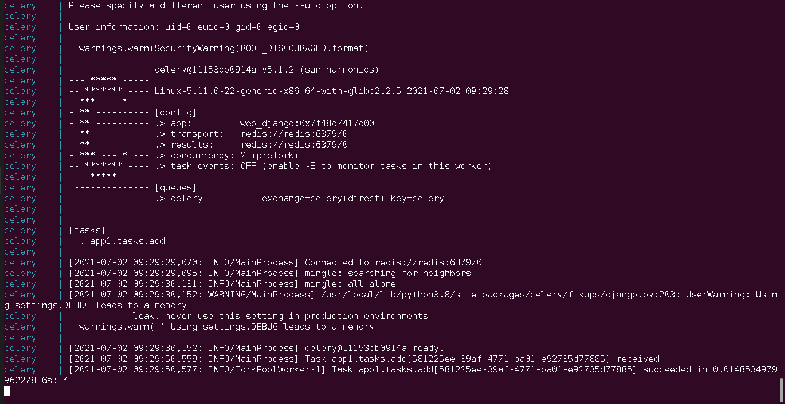

# Django + MySQL + Celery/Redis  in Docker 

This is new project template


## Passwords

Passwords in .env:

```
MYSQL_DATABASE=db_django
MYSQL_USER=web_django
MYSQL_PASSWORD=password
MYSQL_ROOT_PASSWORD=password
```

## Restore MySQL premissions

db_access,sql

```
grant all on db_django.* to 'web_django'@'%';
flush privileges;
```


## Scripts
```
0-init.sh         - init Django project ( already inited )
1-build.sh        - build container
2-migrate-db.sh   - migrate Django DB
3-up.sh           - run container (up)
4-mysql-shell.sh  - MySqql interactive root shell
5-django-shell.sh - Django shell
7-down.sh         - shutdown container
```

## Test
5-django-shell.sh
```
>>> from app1.tasks import add
>>> add.delay(2,2)
<AsyncResult: 581225ee-39af-4771-ba01-e92735d77885>
```


